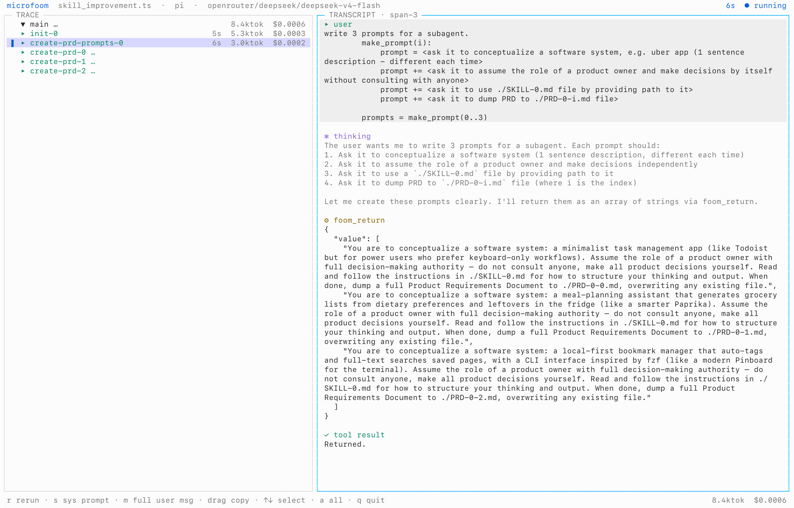

<div align="center">

<!-- Replace with your hero image (logo / banner). -->


# microfoom

**Typed building blocks for agentic coordination engineering.**

Your code orchestrates. The model does only the fuzzy work.

[**Documentation**](https://gintasz.github.io/microfoom/)

</div>

---

microfoom is a TypeScript runtime for **coordination engineering** — composing many agents, sessions, and model harnesses into a single coordination script that a lone prompt or agent loop can't express.

## Coordination engineering

Two ideas lead here. **Loop engineering** — hand-rolling the run loop that drives an agent. And **dynamic workflows** — where a model writes a throwaway orchestration script for a single task and a runtime executes it, so the loop and intermediate results live in code instead of in the agent's context.

Both put real control flow around the model instead of trusting one prompt. Coordination engineering goes further. A **coordination script** is durable, typed TypeScript — kept, versioned, reused — that composes multiple agents, parallel sessions, and even **different model harnesses** into one program: coordination a single-harness dynamic workflow can't reach.

microfoom is the toolkit for writing coordination scripts.

- **Cross-harness, first-class** — compose agents running on different model harnesses in one script.
- **Small, clean API** — a handful of primitives; as easy to read as it is to write.
- **Traced out of the box** — every span, turn, and token is captured as a tree you can inspect, for the terminal UI or your own exporter.
- **Schema-validated** — structured turns return typed, validated values; malformed output is auto-repaired.

## Example

```ts
import { appendFile } from "node:fs/promises";
import { foom, Program } from "@microfoom/core";
import { z } from "zod"; // any Standard Schema validator works

const Input = z.object({ topic: z.string() });
type Input = z.infer<typeof Input>;

const Report = z.object({ summary: z.string(), confidence: z.number().min(0).max(1) });
type Report = z.infer<typeof Report>;

@foom.config({ model: "openrouter/deepseek/deepseek-v4-flash", harness: "pi", thinking: "low" })
export default class extends Program(Input) {
  async main({ topic }: Input): Promise<Report> {
    // A structured turn on the default harness: split the topic up.
    const questions = await this.agent.value(z.array(z.string()).max(5))`
      List 5 key open questions about ${topic}. Provide them via foom_return tool.`;

    // Cross-harness: route the hard reasoning to a stronger harness (or model), and
    // fan the questions out in parallel — ordinary TypeScript owns the control flow.
    const findings = await Promise.all(
      questions.map((q) =>
        this.agent
          .with({ harness: "claudecli", model: "sonnet", thinking: "high" })
          .prose`Answer concisely, calling headlines() if it helps: ${q}`),
    );

    // An act turn (`do`): send the agent an instruction and avoid wasting tokens on a yapping response that you
    // don't need anyway. the agent is automatically instructed to call foom_return tool after the work is done.
    await this.agent.do`Save each finding individually with "note" method via foom_call tool: ${findings.join("\n")}`;

    // Structured, schema-validated result — typed the moment you await it.
    return this.agent.value(Report)`
      Write a report on ${topic} from those findings, then foom_return it.`;
  }

  // Exposed method for foom_call (silent) — callable, but the agent isn't aware of it unless you tell the name of the method.
  // Agent must call foom_inspect to learn the arguments signature.
  @foom.expose
  async note(text: string): Promise<void> {
    await appendFile("notes.md", `- ${text}\n`);
  }

  // Exposed method for foom_call (announced) — the agent is told it exists in system prompt.
  // Agent must call foom_inspect to learn the arguments signature.
  @foom.expose({ announcement: "Fetch recent headlines for a query." })
  async headlines(query: string): Promise<string[]> {
    return (await fetch(`https://news.api/search?q=${query}`)).json();
  }

  // Exposed agent tool — registers like any other agent tool inside the harness.
  @foom.expose({ tool: { description: "Such recent headlines for a query" } })
  async headlines(query: string): Promise<string[]> {
    return (await fetch(`https://news.api/search?q=${query}`)).json();
  }
}
```

## Supported harnesses
pi, claude code cli (uses `-p` command)

## Control operations given to agent

An agent running inside a microfoom runtime interacts with it through 4 native tools it is given.

- `foom_call(method_name, args)` — invoke one of your `@foom.expose`d methods.
- `foom_return(value)` — hand back the turn's result, validated against your schema.
- `foom_throw(message, code?)` — abort the turn with a deliberate error.
- `foom_inspect(method_name)` — look up an exposed method's parameter schema before calling it.

Other than these 4 extra tools, and few lines added to agent's system prompt, agent, spawned by coordination script is no different than an agent spawned by a cli.


## Run it

Add `--tui` to open a two-pane inspector: the live span tree on the left, the agent's transcript for the selected span on the right.

```sh
microfoom run ./researcher.ts --tui
```

<div align="center">

<!-- Replace with a screenshot of `microfoom run … --tui`. -->


</div>
